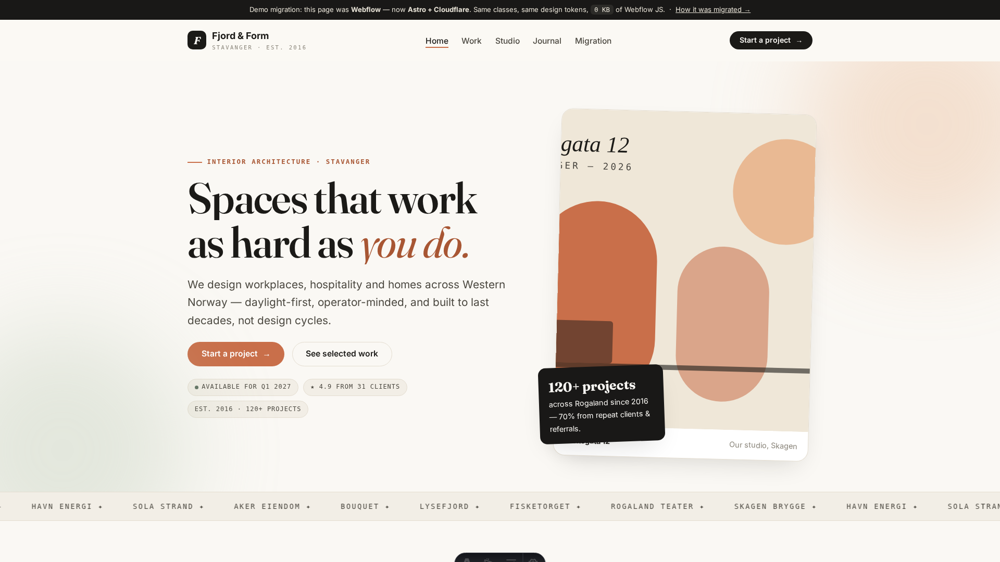
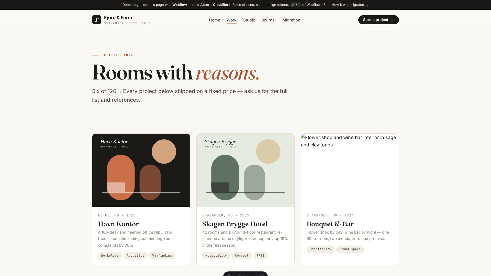
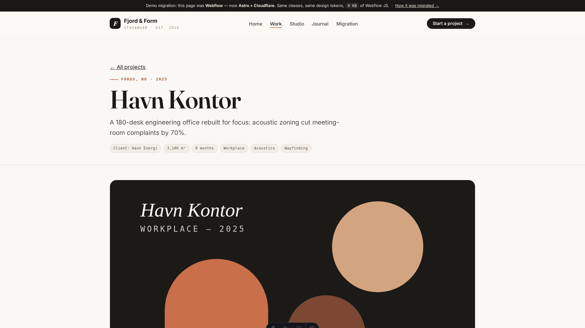
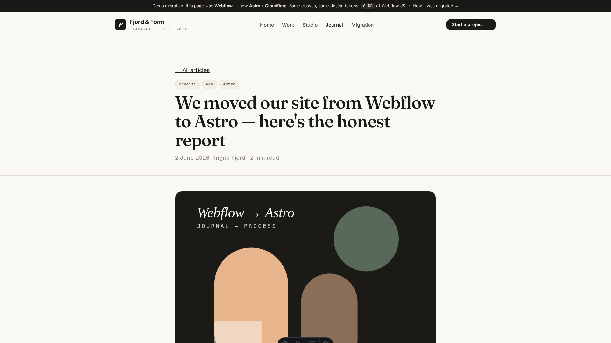
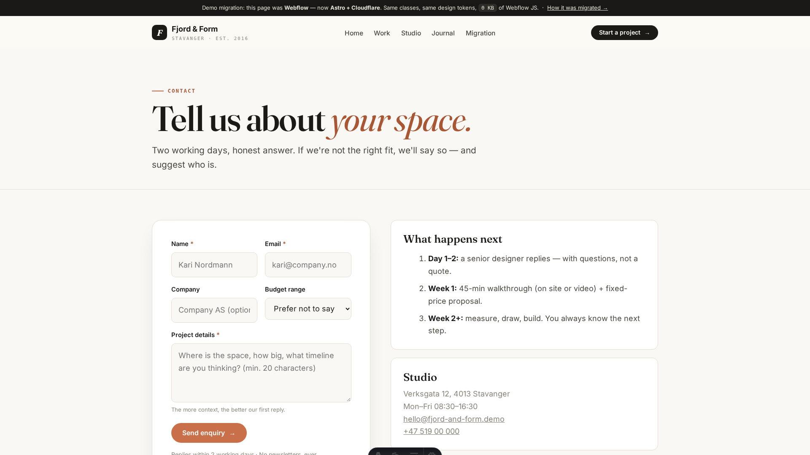
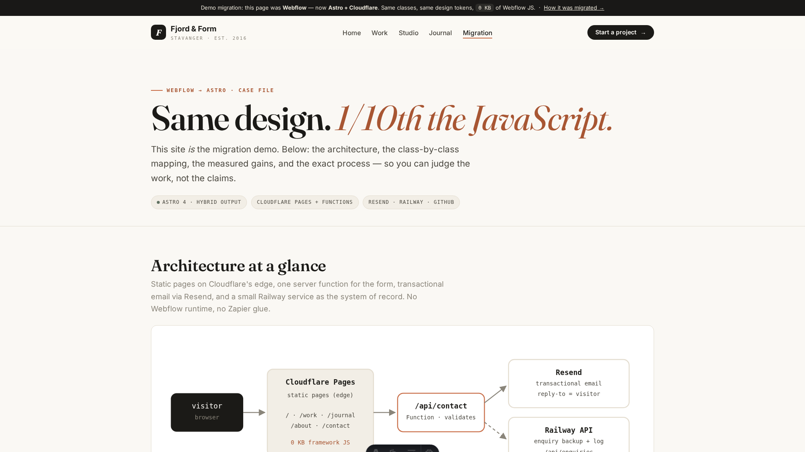
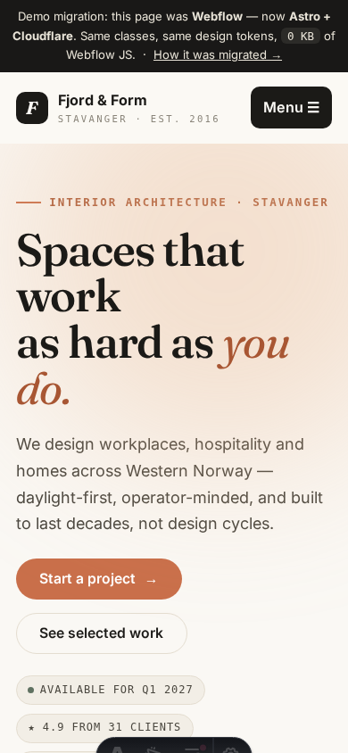
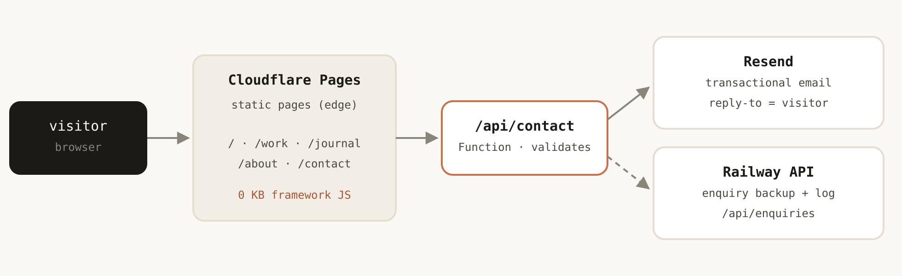

<div align="center">

# Webflow → Astro · End-to-End Migration Demo

**Same design. 1/50th the JavaScript. Fully owned forms, email & infrastructure.**

[](https://astro.build)
[](https://pages.cloudflare.com)
[](https://resend.com)
[](https://railway.app)
[](https://github.com/Waleed-Azam/Astro-Developer-/actions)
[](https://github.com/Waleed-Azam/Astro-Developer-/pulls)

*A complete, runnable rebuild of a Webflow marketing site in Astro — with the migration playbook, QA system & estimation template used to build it.*

</div>

---



## 🎬 5-minute video walkthrough

Prefer watching? Full narrated tour of the site, the code, and the infrastructure — [open the video file](docs/walkthrough.mp4) if the embed doesn't play:

<video src="https://raw.githubusercontent.com/Waleed-Azam/Astro-Developer-/main/docs/walkthrough.mp4" controls="controls" muted="muted" preload="metadata" width="100%"></video>

| ⏱ Timestamp | Chapter |
|---|---|
| 0:00 | Intro — the brief & the stack |
| 0:39 | Homepage tour, section by section |
| 1:28 | Design parity with 1:1 class names, ~8 KB JS |
| 2:17 | Webflow CMS → typed content collections |
| 2:59 | Forms you own: validate → Resend → Railway backup |
| 3:49 | Infrastructure: Cloudflare hybrid + Railway + CI guards |
| 4:37 | Docs, QA system & how to run it yourself |

> Script: [`docs/VIDEO_SCRIPT.md`](docs/VIDEO_SCRIPT.md) · Rebuild the video: `python3 scripts/build-video.py`

---

## ✨ What this is

A fictional client — **Fjord & Form**, an interior studio in Stavanger — with a classic Webflow site: **7 page templates, 2 CMS collections, accordion/slider/marquee interactions, and a contact form**. Rebuilt end-to-end in Astro with **design parity, 1:1 class names, and ~8 KB of client JavaScript** (measured — down from ~412 KB of Webflow runtime).

| Webflow | → | This repo |
|---|---|---|
| Style Guide page | → | CSS custom properties + same class names |
| Navbar / Footer symbols | → | `Header.astro` / `Footer.astro` components |
| CMS: Projects, Blog | → | Typed Markdown collections (Zod-validated) |
| Scroll / accordion / slider IX | → | ~200 lines of vanilla JS, zero dependencies |
| Webflow Forms + Zapier | → | `/api/contact` → Resend email + Railway backup |
| Webflow hosting | → | Cloudflare Pages + Functions, preview per PR |

Every claim is verifiable: run it, open DevTools, disable JavaScript, read the CI guards.

## 🖼️ Tour

| | |
|---|---|
|  **Work index** — collection listing, tag filters by design |  **Case page** — static dynamic route + related projects |
|  **Journal** — CMS blog → Markdown, read-next links |  **Contact** — validated form → Resend + Railway |
|  **`/migration`** — the "show your work" page: mapping table, gains, process |  **Responsive** — 4 breakpoints, mobile menu, no-JS safe |

<details>
<summary>📐 Architecture (click to expand)</summary>
<br/>



- **Cloudflare Pages** serves 16 static pages from the edge + **one Function** (`/api/contact`)
- **Resend** sends the enquiry email (`reply-to` = visitor)
- **Railway** (`backend/`, zero-dep Node) stores a backup copy — no lead is ever lost
- **GitHub Actions** type-checks, builds, verifies routes & fails on any Webflow/jQuery runtime leak

</details>

## 🚀 Run it (2 minutes)

```bash
npm install
cp .env.example .env   # optional — the form runs in mock mode without keys
npm run dev            # → http://localhost:4321
```

Optional — the Railway backend alongside (the form degrades gracefully without it):

```bash
cd backend && npm start   # → http://localhost:3001/health
```

**Try this:** `/` (every interaction) → `/work` → `/work/havn-kontor` → `/journal` → `/contact` (submit the form — works with or without a Resend key) → `/migration` (the full case file).

## 🗂️ Repo map

| Path | What it proves |
|---|---|
| `src/pages/` | 7 templates + dynamic CMS routes + `api/contact.ts` server function |
| `src/content/{projects,journal}/` | Webflow CMS → typed Markdown (schemas in `src/content/config.ts`) |
| `src/components/ContactForm.astro` | Progressive-enhancement form, honeypot, shared validation |
| `src/lib/` | Validation (client+server) + Resend helper with mock-mode dev |
| `src/styles/global.css` | Webflow style guide → CSS tokens, identical class names |
| `backend/` | Railway service: `/health`, enquiry backup, newsletter — zero deps |
| `docs/` | 🎬 `walkthrough.mp4`, screenshots, `VIDEO_SCRIPT.md`, `architecture.svg` |
| `scripts/` | `export-webflow-audit.mjs` (pre-migration inventory), `build-video.py` |
| `.github/` | CI (check → build → smoke tests) + PR template with screenshot gate |

## 📚 The system behind the demo

This repo ships the **working system**, not just the site:

1. [`MIGRATION_PLAYBOOK.md`](MIGRATION_PLAYBOOK.md) — the 6-phase method: audit → content → rebuild → forms/deploy → QA → launch, with commands & exit gates
2. [`QA_CHECKLIST.md`](QA_CHECKLIST.md) — 8 pre-handover quality gates (breakpoints, browsers, a11y, perf, SEO, failure drills)
3. [`ESTIMATION_TEMPLATE.md`](ESTIMATION_TEMPLATE.md) — ranges + assumptions + explicit buffer, with a worked 6–10 day example
4. [`APPLICATION_KIT.md`](APPLICATION_KIT.md) — ready-to-send collaboration answers
5. [`docs/VIDEO_SCRIPT.md`](docs/VIDEO_SCRIPT.md) — the 5-minute walkthrough narration

## ✅ Verify it yourself

```bash
npm run build                                # check + Cloudflare build, 16 routes
grep -rli "webflow\.js\|jquery-3" dist/      # → no matches (CI enforces this)
node scripts/export-webflow-audit.mjs        # → the pre-migration inventory format
```

- DevTools → Network → JS: homepage ships **~8 KB**, zero framework
- Disable JavaScript: content, nav & native form POST still work
- Kill the backend, submit the form: still succeeds (best-effort backup, tested)

## ☁️ Deploy

**Frontend (Cloudflare Pages):** connect repo → build `npm run build`, output `dist`, Node 20 → secrets `RESEND_API_KEY`, `CONTACT_TO_EMAIL`, `RAILWAY_API_URL`.
**Backend (Railway):** service from `/backend` → vars `ADMIN_TOKEN`, `ALLOWED_ORIGINS` → healthcheck `/health`.

---

<div align="center">

Built by **Waleed Azam** — Astro developer, Webflow migrations & production builds.

🎬 [Video walkthrough](docs/walkthrough.mp4) · 📖 [Migration playbook](MIGRATION_PLAYBOOK.md) · ✅ [QA checklist](QA_CHECKLIST.md)

</div>
